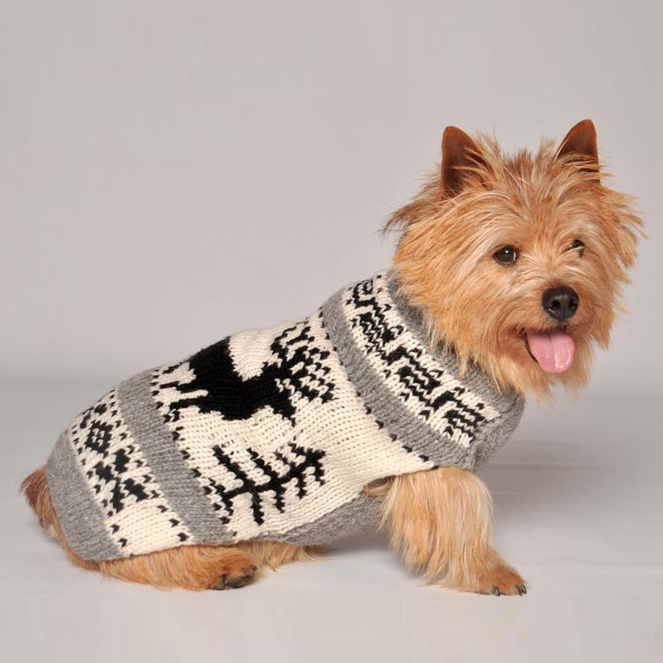
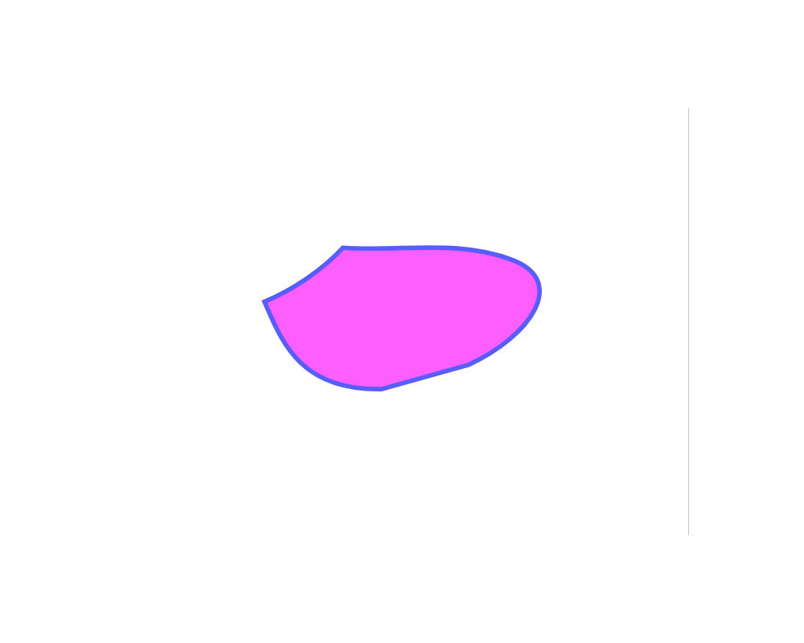
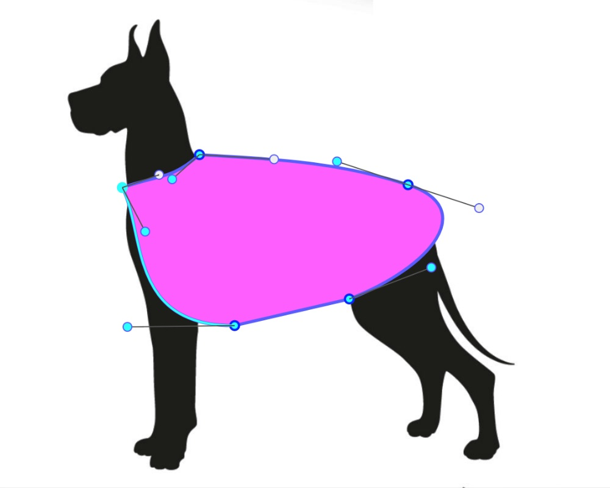
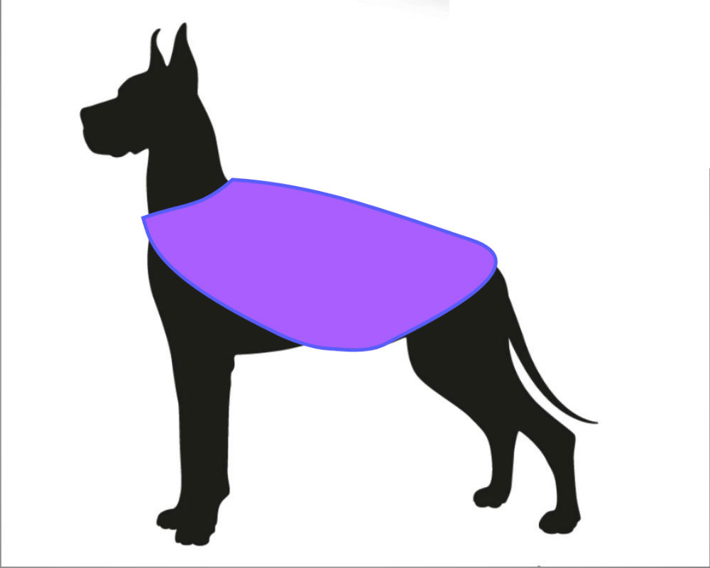
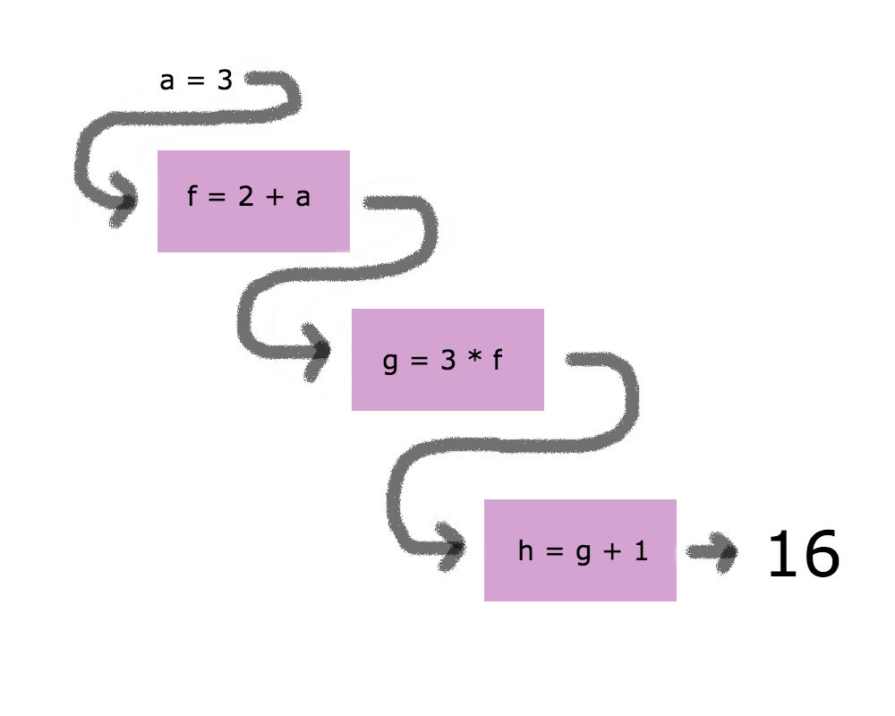

---?image=assets/bg1.jpeg

---?image=assets/bg2.jpeg

Note: How many rails devs?  Elixir devs?  Just starting out?  Anything else you'd like me to ask?

---?image=assets/bg3.jpeg

Note: This is practical - Compare/Contrast (mostly contrast) with rails counterparts.


---?image=assets/bg4.jpeg

Note: Let' start with images...

---?image=assets/bg5.jpeg

Note: Create thumbnails, resize etc. as with Paperclip or Carrierwave in Rails

---?image=assets/bg6.jpeg

Note: Local store (as opposed to cdn), use Arc Ecto to integrate the two. Going over the highlights here.

---

## Multiple Images

```elixir
    <%= file_input @form, :image_uploads,

      class: "validate",

      multiple: true,

      name: "user[image_upload][]" %>
```

Note: From here, you can iterate over the map of files for processing or saving, either as embeds array, or association.


---



---

```elixir
def changeset(struct, params \\ %{}) do
  struct
  |> cast(params, [:name, :description, :user_id])
  |> cast_attachments(params, [:photo])
  |> validate_required([:name, :description, :user_id])
  |> unique_constraint(:name, message: "already taken")
end
```

@[1-3]
@[4]
@[1-7]

---

## Image Gotcha

### No Record ID on Create

```elixir

# uploaders/avatar
def storage_dir(_, {_, scope}) do

   "priv/static/images/user/#{scope.id}"

end
```

Note: Scope.id not available on create.

---

### Workaround

#### Use separate changesets for create and update

---

## Plug.Upload Struct

### within changeset function params

---

```elixir
#[debug] Processing by Knitwhiz.DesignController.update/2

parameters: %{
  "id" => "6",
  "design" => %{
    "description" => "doggie sweater",
    "name" => "Fido's Sweater",
    "photo" => %Plug.Upload{
      content_type: "image/png",
      filename: "fidos-sweater.png",
      path: "/var/folders/2s/fs..66/T//plug-1493/multipart-53892"
    },
    "supplies" => "yarn"
  }
}
```

@[8-12]


Note: Plug.Upload  Genserver process saves upload struct to a temp directory. After process dies the file moved to permanent home (either cdn or local store)

---

### Programatically Insert Images

---



#### Clone Template
---

```elixir

  case Repo.insert(changeset) do

    {:ok, pattern} ->
      template = Repo.get!(
        Template, pattern_params["template_id"])

      path = "priv/static/images/templates/#{template.id}"

      PatternImage.store({path, pattern})

      pattern_img_param =
        %{pattern_image_url:
          "priv/static/images/patterns/#{pattern.id}"}
      |> update_pattern
  end

```

@[1-3]

@[4-5]

@[4-9]

@[1-15]

### Store After Create

Note: Explain Background - User form for other info -> onCreate, get image associated with parent

---

## Amazon S3

Note: templates are assets -> move user copies to s3

---

### With Arc

#### https://github.com/stavro/arc

---

### Or Without Arc (Elixir)

* :ex_aws & :ex_aws_s3 packages
* Create a Module
* Follow the README

#### https://github.com/ex-aws/ex_aws

Note: use mix task to move images onto s3 when ready...lead in to API

---

# B is for Backend

### Phoenix/Elixir API


Note: often no need to use binary data (rails... used binary data) but Arc supports it


---


```javascript

handleImageChange(e) {
  e.preventDefault();

  const reader = new FileReader();
  const file = e.target.files[0];

  reader.onloadend = () => {
    this.setState({
      imagePreviewUrl: reader.result
    });
    this.setState({ design: { photo: file } });
  }

  reader.readAsDataURL(file)
}

handlePhotoUpdate() {
  this.props.setDesignField('photo', this.state.design.photo);
  this.props.submitPhotoUpdate(this.props.designId);
}
```

@[1-4]

@[6-11]

@[5, 10]

@[1-16]

### React Form Component

---

```javascript

export const updatePhoto = (id) => (
  (dispatch, getState) => {
    const { formData } = getState().designs;
    let form_data = new FormData();

    Object.keys(formData).forEach((key) => {
      if (formData[key] instanceof File) {
        form_data.append(`design[${key}]`, formData[key], formData[key].name);
      } else {
        form_data.append(`design[${key}]`, formData[key]);
      }
    });

    httpPostForm(`/api/v1/designs/${id}`, form_data)
    .then((resp) => {
```

@[3]

@[4]

@[6-12]

@[14]

### Update Action

Note: Redux
---

### Endpoint Receives Image Data from a Client Application

---

### FormData objects must be sent in a POST request

#### update router.ex

* resources "/designs", DesignController, except: [:new, :edit]
* post "/designs/:id", DesignController, :update


Note: FormData objects require a POST request

---

# C is for Copy

---


### Copy inside a Mix Task

#### Using File Module

Note: suppose admin, not using Arc, etc. & want to copy a template to further manipulate.

---

#### Elixir

```elixir
cp(source, destination, callback \\ fn _, _ -> true end)
# => {:ok} OR {:error, :reason}
```
#### OR Erlang

```elixir

copy(source, destination, bytes_count \\ :infinity)
# => {:ok, :bytes_copied} OR {:error, :reason}
```
Note:  copy without using Arc Storage, or copy from S3 for example...

---


### User manipulation of SVG file

---

```xml

<svg width="640" height="480" xmlns="http://www.w3.org/2000/svg" xmlns:svg="http://www.w3.org/2000/svg">
 <g>
  <title>Layer 1</title>
  <path
    id="svg_6"
    stroke="#5656ff"
    d="m159.408943,208.251741c31.05263,-13 64.10526,-35
      87.15789,-60c62.94737,4.66667 128.89473,
      -9.66667 188.8421,14c59.94737,23.66667 19.62907,
      84 -49.55639,116l-96.74435,27c-90.45113,
      1.33333 -110.41354,-52.33333 -129.69925,-97z"
    stroke-linecap="null"
    stroke-linejoin="null"
    stroke-dasharray="null"
    stroke-width="5"
    fill="#ff56ff" />
 </g>
</svg>

```

#### Dog Sweater Template SVG

---



### Using D3 or similar library

---


### Save the Transformed File...

---

#### Using Nokogiri with Rails

```ruby
# AJAX POST -> updates svg path with Nokogiri

  def update_path
    if params[:id] && params[:svg_d_attr]
      @pattern = Pattern.find(params[:id].to_i)

      file_path = "#{Rails.root}/public/#{@pattern.image_url}"

      doc = Nokogiri::XML(File.read file_path)

      doc.css("path").first["d"] = params[:svg_d_attr]

      File.open(file_path,'w') {|f| doc.write_xml_to f}
    end
  end
```

@[7]

@[9-11]

@[13]

@[1-14]

Note:  get the file path, then set the css then write to the file

---
#### Using Floki with Phoenix

```elixir
@doc """
  Changes the attribute values of the elements matched
  by `selector` with the function `mutation` and returns
  the whole element tree

  svg
  |> Floki.attr("path", "d", fn_ ->  params["svg_d_attr"]) end)

```

Note: (tree, element, attribute, mutation function)

---

## The Pipe Operator

---


---

### Ruby or Javascript

#### Conditionals

---

```Ruby
def complete_purchase(purchase, is_birthday, coupon)
  if present?(coupon)
    apply_discount(purchase, coupon)
  elsif is_birthday
    if purchase > 2000
      send_big_treat
    else
      send_little_treat
    end
  else
    say_thank_you
  end
end
```

---

### Elixir

#### Guard clauses

---

```elixir
def complete_purchase(purchase, is_birthday, coupon) when is_nil(coupon) do
  case is_birthday do
    true -> send_treat(purchase)
    _ -> say_thank_you
  end
end
def complete_purchase(purchase, is_birthday, coupon) do
  apply_discount(purchase, coupon)
end

defp send_treat(purchase) when purchase > 20, do: send_big_treat
defp send_treat(purchase), do: send_little_treat

```
@[1]

@[1-6]

@[7-9]

Note: one way of writing with elixir

---

#### Refactor with Pipe operator

```elixir
def complete_purchase(purchase, is_birthday, coupon) do
  apply_coupon(coupon)
  |> check_birthday(is_birthday)
  |> send_treat(purchase)
end

defp apply_coupon(coupon) when is_nil(coupon), do: {:continue, "no coupon"}
defp apply_coupon(coupon) do
  calculate_discount
  # => {:stop, "discount applied"} OR {:stop, "error occurred"}
end

defp check_birthday({:stop, reason}, is_birthday), do: {:stop, reason}
defp check_birthday({:continue, reason}, is_birthday) when !is_birthday do
  say_thank_you
  {:stop, "no birthday"}
end
defp check_birthday({:continue, reason}, is_birthday) do
  {:continue, "has birthday"}
end

defp send_treat({:stop, reason}, purchase), do: {:stop, reason}
defp send_treat({:continue, reason}, purchase) when purchase > 2000, do: send_big_treat
defp send_treat({:continue, reason}, purchase), do: send_little_treat
defp send_treat(_, _), do: {:error, "Hmmmm....."}
```

@[1-5]

@[7-11]

@[13-20]

@[21-24]

Note: Another use for pipes next

---

#### Using Pipes with

### Ecto Multi

```elixir
  def manage_stripe_charge(user, design_id, design_name, token, amount) do
    Multi.new
    |> Multi.run(:retrieve_customer, &retrieve_customer(&1, user.stripe_id, token))
    |> Multi.run(:update_user, &update_user(&1.retrieve_customer, user))
    |> Multi.run(:stripe_charge, &stripe_charge(&1.retrieve_customer, amount))
    |> Multi.run(:insert_project, &insert_order(&1.stripe_charge, user.id, design_id))
    |> Multi.run(:insert_charge, &insert_charge(&1.insert_order))
    |> Multi.run(:send_dog_treat, &send_dog_treat(user))
  end

  defp retrieve_customer(val, customer_id, token) when is_nil(customer_id) do
    register_customer(val, token["email"], token["id"])
  end
  defp retrieve_customer(_, customer_id, _) do
    Stripe.Customer.retrieve(customer_id)
  end
  # ...

```

@[1-3, 11-16]

@[1-16]

Note: Ecto.Multi is a data structure for grouping multiple Repo operations. functions include "insert", "update" & delete in addition to 'run'.  Changesets checked for these.  This is very useful when an operation depends on the value of a previous operation. For this reason, the function given as callback to run/3 and run/5 will receive all changes performed by the multi so far as a map in the first argument.  The function given to run must return {:ok, value} or {:error, value} as its result.

---

### Call the function

```elixir
    charge = Repo.transaction(
      PaymentService.manage_stripe_charge(
        user, design_id, design_name, token, retail)
    )
```

---

### Returns

<p> {:ok, %{return_values}}
  <br />
  OR
  <br />
  {:error, failed_operation, failed_value, changes_so_far}
</p>

Note:  The multi map is an accumulator ... which brings us to our last topic:  Recursion

---
## Recursion

---

```elixir
  defp check_treats(treats_array) do
    _check_treats(treats_array, %{total_count: 0, types: [])
  end

  defp _check_treats([], info_map), do: info_map
  defp _check_treats([head | tail], info_map) do
    treat_info = get_treat_info(head)

    _check_treats(tail,
      %{total_count: treat_info.count + info_map.total_count,
        types: [treat_info | info_map.types]
      })
  end

  defp get_treat_info(treat) do
    %{count: treat.count, name: treat.name}
  end
```

@[1-3]

@[5]

@[6-13]

@[1-17]

Note: Linked List data structure, in place of iteration over while loops in Ruby.

---


---

## Links

---

#### Floki

##### https://github.com/philss/floki


#### Ecto.Multi

##### https://hexdocs.pm/ecto/Ecto.Multi.html

---

#### Stripity Stripe

##### https://hexdocs.pm/stripity_stripe/2.0.0-alpha.10


#### Ticket to Fly

##### https://gitpitch.com/cathyzoller/ticket_to_fly

---

## Acknowledgements


#### https://www.freepik.com/free-photos-vectors/dog

#### http://moderndogmagazine.com/articles/dog-sweaters-so-cute-youll-want-wear-them/91180
