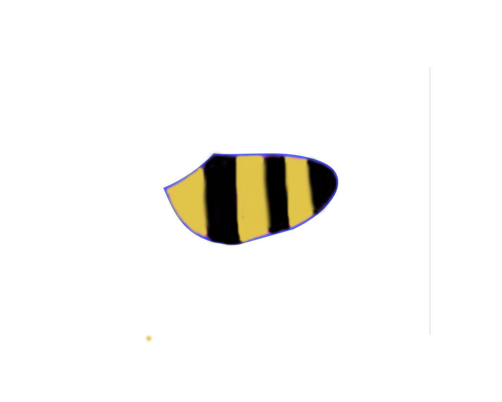
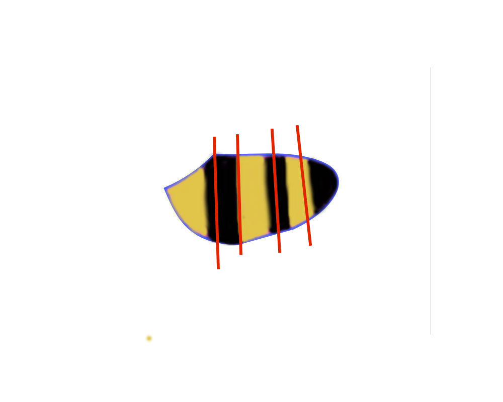

---?image=assets/bg1.jpeg

Note: Over the past year and a half I've been working on a re-write of a side project located at KnitWiz.com, an application allowing hand-knitters to design sweaters and auto generate instructions using their measurements and any pattern stitch or yarn they desire.  It launched about a month ago, & is being beta tested right now by a group of dedicated early adopters. Originially I wrote the app using ruby on rails, and a lot of jquery... it chugged along(next slide)

---?image=assets/bg2.jpeg

Note: Today it flies with phoenix as an api and a React front-end. I'd like to talk about three  stops along my personal camino to an mvp and the gradual shift in my thinking along the way, going from an object-oriented approach to a functional one. (next slide)

---?image=assets/bg3.jpeg

Note: File Uploads, Ecto.Multi and Recursion. BTW How many of you are just beginning with Elixir/Phoenix?  Use as an api? Use React? How many of you knit (next slide)

---?image=assets/bg4.jpeg

Note: First stop -> File uploads

---?image=assets/bg5.jpeg

Note: Arc is the primary hex package used for file uploads. As with ruby gems Paperclip or Carrierwave, Arc works with imagemagick for thumbnail creation or other processing.  And that's about where the similarity ends.  Arc takes advantage of the Plug.Upload struct - more detail about that later. Once uploaded, the return is a standard tuple. (slide)

---?image=assets/bg6.jpeg

Note: Scoping uploads to a specific record requires Arc_Ecto package as well. Arc Ecto provides a cast_attachments function, to be called inside the changeset function (next slide)

---

```elixir
def changeset(struct, params \\ %{}) do
  struct
  |> cast(params, [:name, :description, :user_id])
  |> cast_attachments(params, [:photo])
  |> validate_required([:name, :description, :user_id])
  |> unique_constraint(:name, message: "already taken")
end
```

@[4]

Note: A typical changeset function(next slide) -> results of the cast function are piped to the cast_attachments function.

---

### Uploader

```elixir
# uploaders/photo
def acl(:original, _), do: :public_read

def storage_dir(_, {_, scope}) do
   "uploads/design/#{scope.id}"
end
```

@[4-6]
@[2]

Note: configuration for arc uploads is at the root level inside an uploaders directory(next slide)
In this example the path is set for AWS s3, and scoped to the design's record id.  One gotcha is that the scope.id not available on create. Workaround - create then update with a different changeset functions (slide) Another is - for public display of images hosted on AWS S3 add a public read acl. I'll go over the basic process & then delve into xml file manipulation

---


Note: Here's an adorable dog sweater that I might want to design

---


Note: In knitwiz you'll start with an svg like this, which is an xml file.  In either case, the basic upload process is as follows.

---
### React Form Component

```javascript
handleImageChange(e) {
  e.preventDefault();

  const reader = new FileReader();
  const file = e.target.files[0];

  reader.onloadend = () => {
    this.setState({
      imagePreviewUrl: reader.result
    });
    this.setState({ design: { photo: file } });
  }

  reader.readAsDataURL(file)
}

handlePhotoUpdate() {
  this.props.setDesignField('photo', this.state.design.photo);
  this.props.submitPhotoUpdate(this.props.designId);
}
```

@[16-19]

Note: javascript's FileReader is used on the frontend to load a preview.  (next slide) Then a phoenix endpoint is called from "submitPhotoUpdate" (next slide)

---

```javascript
export const updatePhoto = (id) => (
  (dispatch, getState) => {
    const { formData } = getState().designs;
    let form_data = new FormData();

    Object.keys(formData).forEach((key) => {
      if (formData[key] instanceof File) {
        form_data.append(`design[${key}]`, formData[key], formData[key].name);
      } else {
        form_data.append(`design[${key}]`, formData[key]);
      }
    });

    httpPostForm(`/api/v1/designs/${id}`, form_data)
    .then((resp) => {
```

@[14]


Note: which appends the data to form_data object (slide) and POSTS it to a phoenix endpoint via fetch.  Note that all we need to provide is the name of the file.

---

### FormData objects must be sent in a POST request

#### update router.ex

* resources "/designs", DesignController, except: [:new, :edit]
* post "/designs/:id", DesignController, :update


Note: FormData objects require a POST request

---

### Endpoint Receives Image Data from a Client Application

---

```elixir
#[debug] Processing by Knitwiz.DesignController.update/2

parameters: %{
  "id" => "6",
  "design" => %{
    "description" => "doggie sweater",
    "name" => "Fido's Sweater",
    "photo" => %Plug.Upload{
      content_type: "image/png",
      filename: "fidos-sweater.png",
      path: "/var/folders/2s/fs..66/T//plug-1493/multipart-53892"
    },
    "supplies" => "yarn"
  }
}
```

@[8-12]

Note: Here we see the params passed to the controller action...(next slide) controller has access to Plug.Upload uses a Genserver process to save the file to a temp directory. Once the file is uploaded to a permanent location based on Uploader configuration, the GenServer process dies and the file is. And that's all there is to it.  Overall, I found Arc faster and simpler to configure than its rails counterpart, and was very happy to leave direct client-side uploads behind. (next slide)

---

### SVG file manipulation


Note: But what about file or document manipulation?  We've got this template on s3, uploaded in the usual way. original dog sweater template is copied inside s3 & pulled down to manipulate inside to further manipulate.(slide)

---

#### Elixir

```elixir
File.cp(source, destination, callback \\ fn _, _ -> true end)
# => {:ok} OR {:error, :reason}
```
#### OR Erlang

```elixir

:file.copy(source, destination, bytes_count \\ :infinity)
# => {:ok, :bytes_copied} OR {:error, :reason}
```
Note: Otherwise, When working with files on the server, copy files using the File module


---

```xml
<svg width="640" height="480" xmlns="http://www.w3.org/2000/svg" xmlns:svg="http://www.w3.org/2000/svg">
 <g>
  <title>Layer 1</title>
  <path
    id="svg_6"
    stroke="#5656ff"
    d="m159.408943,208.251741c31.05263,-13 64.10526,-35
      87.15789,-60c62.94737,4.66667 128.89473,
      -9.66667 188.8421,14c59.94737,23.66667 19.62907,
      84 -49.55639,116l-96.74435,27c-90.45113,
      1.33333 -110.41354,-52.33333 -129.69925,-97z"
    stroke-linecap="null"
    stroke-linejoin="null"
    stroke-dasharray="null"
    stroke-width="5"
    fill="#ff56ff" />
 </g>
</svg>
```

@[7-11]

#### Dog Sweater Template SVG

Note: Here's the xml representing the svg file.  Changing the path argument "d" will change the shape.

---


### Using d3 or similar library

Note: Once the template is overlayed onto a model, it can be manipulated with d3 or fabric.js (although fabric.js doesn't have react syntax baked in, it wasn't difficult to refactor)(slide)

---


### Save the Transformed File...

---

#### Using Nokogiri with Rails

```ruby
# AJAX POST -> updates svg path with Nokogiri

  def update_path
    if params[:id] && params[:svg_d_attr]
      @pattern = Pattern.find(params[:id].to_i)

      file_path = "#{Rails.root}/public/#{@pattern.image_url}"

      doc = Nokogiri::XML(File.read file_path)

      doc.css("path").first["d"] = params[:svg_d_attr]

      File.open(file_path,'w') {|f| doc.write_xml_to f}
    end
  end
```

Note:  get the file path (next), then set the css(next) then write to the file(next) - took a little over 2 seconds so make sure you have a loading spinner!

---

```elixir
  %HTTPoison.Response{body: body, status_code: status_code} = HTTPoison.get!(file_path)

  case status_code do
    200 ->
      tmp_path = "tmp/#{pattern_piece.id}/#{pattern_piece.pattern_name}.svg"
      File.mkdir("tmp/#{pattern_piece.id}")
      File.write!(tmp_path, body)

      case PatternPiece.transform_path(tmp_path, params["path"]) do
        {:ok, _} ->
          PatternImage.store({tmp_path, pattern_piece})

          %{status: 201, msg: "success"}
        {:error, _} ->
          %{status: 422, msg: "error in transform"}
      end
    _ ->
      %{status: 422, msg: "file not found"}
  end
```

@[1]
@[3-7]
@[9-11]

Note: s3 will return something whether or not the file exists(next). Switch on the status_code (next) & if a 200 response then write the file to a temporary directory, prior to transforming. (next).  If the transformation is successful, then replace the version on s3 with this one.  (slide)

---

## Floki

```elixir
def transform_path(svg_url, new_path) do
  File.open(svg_url, [:read, :write], fn(file) ->
    svg = IO.read(file, :all)
    |> Floki.attr("path", "d", fn _ ->  new_path end)
    |> prepend_xml
    |> Floki.raw_html

    File.write(svg_url, svg)
  end)
end

defp prepend_xml(list), do: [{:pi, "xml", [{"version", "1.0"}]} | list]
```

#### Floki.attr(tree, element, selector, mutation function)

Note: For the actual transformation we can use Floki.attr method. Floki works by creating a list of the xml or html elements. The attr function changes the attribute values of the elements matched by `selector` with the function `mutation` and returns the whole element tree.  Using elixir speeds the process up to 100 to 200 ms, and about 55 ms without latency. The takeaway here is that uploading server-side in elixir is fast enough that you don't need to do client-side uploads, unless you enjoy that pain.  Ok, so we're ready to make the sweater.  What's next?  (NEXT)

---

## Ecto.Multi

#### database transaction

Note: GETTING PAID.  How many of you have heard of or used Ecto Multi?  Ecto.Multi groups operations to be performed as a single database transaction.  In the beginning I had a hard time understanding the syntax.  I was used to writing code like this(next slide)

---

```Ruby
def complete_purchase(purchase, is_birthday, coupon)
  if !nil?(coupon)
    apply_discount(purchase, coupon)
  elsif is_birthday
    if purchase > 2000
      send_big_treat
    else
      send_little_treat
    end
  else
    say_thank_you
  end
end
```

Note: using nested conditionals.  here we want to send something once the purchase is completed... if there's a coupon apply a discount.  Otherwis if it's a birthday, then send either a big treat or a little treat, depending on the purchase amount.  But if neither of those conditions apply, then just say thanks.

---

### Elixir

#### Guard clauses

Note: I started out in elixir using a lot of guard clauses. (next slide)

---

```elixir
def complete_purchase(purchase, is_birthday, coupon) when is_nil(coupon) do
  case is_birthday do
    true -> send_treat(purchase)
    _ -> say_thank_you
  end
end
def complete_purchase(purchase, _is_birthday, coupon) do
  apply_discount(purchase, coupon)
end

defp send_treat(purchase) when purchase > 20, do: send_big_treat
defp send_treat(_purchase), do: send_little_treat
```
@[1, 7]

@[1-6, 11-12]


Note: one way of writing with elixir (next slide) using guard clauses.  (next slide) But I'm still using a case statement inside the complete_purchase function.  (next slide)

---

#### Refactor with Pipe operator

```elixir
def complete_purchase(purchase, is_birthday, coupon) do
  apply_coupon(coupon)
  |> check_birthday(is_birthday)
  |> send_treat(purchase)
end

defp apply_coupon(coupon) when is_nil(coupon), do: {:continue, "no coupon"}
defp apply_coupon(coupon) do
  calculate_discount
  # => {:stop, "discount applied"} OR {:stop, "error occurred"}
end

defp check_birthday({:stop, reason}, _is_birthday), do: {:stop, reason}
defp check_birthday({:continue, reason}, is_birthday) when !is_birthday do
  say_thank_you
  {:stop, "no birthday"}
end
defp check_birthday({:continue, reason}, is_birthday) do
  {:continue, "has birthday"}
end

defp send_treat({:stop, reason}, _purchase), do: {:stop, reason}
defp send_treat({:continue, reason}, purchase) when purchase > 2000, do: send_big_treat
defp send_treat({:continue, reason}, _purchase), do: send_little_treat
defp send_treat(_, _), do: {:error, "Hmmmm....."}
```

@[1-5]

@[7-11]

@[13-20]

@[21-25]

Note: Here's a cleaner way of writing the same feature (NEXT SLIDE)- we have one public function.  Inside the apply coupon function pipes a tuple to the check birthday, which in turn pipes a different tuple to the third function.  (NEXT) Pattern matching and guard clauses are used together to determine which clause to execute.  This is the same principal used with Ecto.Multi (NEXT)

---


### Ecto Multi

```elixir
  def manage_stripe_charge(user, design_id, design_name, token, amount) do
    Multi.new
    |> Multi.run(:retrieve_customer, &retrieve_customer(&1, user.stripe_id, token))
    |> Multi.run(:update_user, &update_user(&1.retrieve_customer, user))
    |> Multi.run(:stripe_charge, &stripe_charge(&1.retrieve_customer, amount))
    |> Multi.run(:insert_order, &insert_order(&1.stripe_charge, user.id, design_id))
    |> Multi.run(:insert_charge, &insert_charge(&1.insert_order))
    |> Multi.run(:send_dog_treat, &send_dog_treat(user))
  end

  defp retrieve_customer(val, customer_id, token) when is_nil(customer_id) do
    register_customer(val, token["email"], token["id"])
  end
  defp retrieve_customer(_, customer_id, _) do
    Stripe.Customer.retrieve(customer_id)
  end
  # ...

```

Note: Ecto Multi uses the same approach.  What it is: Ecto.Multi is a data structure for grouping multiple Repo operations. functions include "insert", "update" & delete in addition to 'run'.  The difference here is that the return of each function is added to an accumulator which is returned to the calling function - in my case it's a call to handle stripe payments from inside a controller action.  This is very useful when an operation depends on the value of a previous operation.  The function given to run must return {:ok, value} or {:error, value} as its result. (next slide)


---

### Returns

<p> {:ok, %{return_values}}
  <br />
  OR
  <br />
  {:error, failed_operation, failed_value, %{changes_so_far}}
</p>

Note:  Notice both returns are tuples and the last value in the tuple is a map of the individual function returns.  Did I mention "accumulator"?  Essentially ecto.multi accumulates the data returned from each individual operations. which brings us to our final topic:  Recursion

---

## Recursion

#### the best thing since dogs

Note: I found recursion to be indispensible in order to accomplish what I wanted with knitwiz (next slide)

---



Note: someone wants to design a bumblebee costume, and they add stripes. (next slide)

---



Note: but the stripes may or may not line up with the changes in shape.  I've got 5 different shapes I'm working with, but within that shape I need to consider whether or not to start the next stripe.  Not only that, I don't really know how many stripes within each shaped section.

---

```elixir
  defp shape_dog_sweater() do
    section_one(%{stripe_index: 0, percent_worked: 0, stripe_ht: 0})
    |> section_two
    |> section_three
    #  .
    #  .
    #  .
  end

  defp section_one(map) do
    check_height(map)
  end

  defp check_height(map) do
    _check_height(map, map.end_height, map.stripe_ht)
  end

  defp _check_height(map, shape_ht, stripe_ht) when stripe_ht < shape_height do
    # ... stays same color to end of shape
  end
  defp _check_height(map, shape_ht, stripe_ht) do
    # some math
    # update the map

    _check_height(updated_map, new_shape_ht, stripe_ht)
  end
```

Note: Explain the code.

---


---

### Mojotech.com
#### yes, we're hiring


---

## Links

---

#### Floki

##### https://github.com/philss/floki


#### Ecto.Multi

##### https://hexdocs.pm/ecto/Ecto.Multi.html

---

#### Stripity Stripe

##### https://hexdocs.pm/stripity_stripe/2.0.0-alpha.10


#### Ticket to Fly

##### https://gitpitch.com/cathyzoller/ticket_to_fly

---

## Acknowledgements


#### https://www.freepik.com/free-photos-vectors/dog

#### http://moderndogmagazine.com/articles/dog-sweaters-so-cute-youll-want-wear-them/91180
