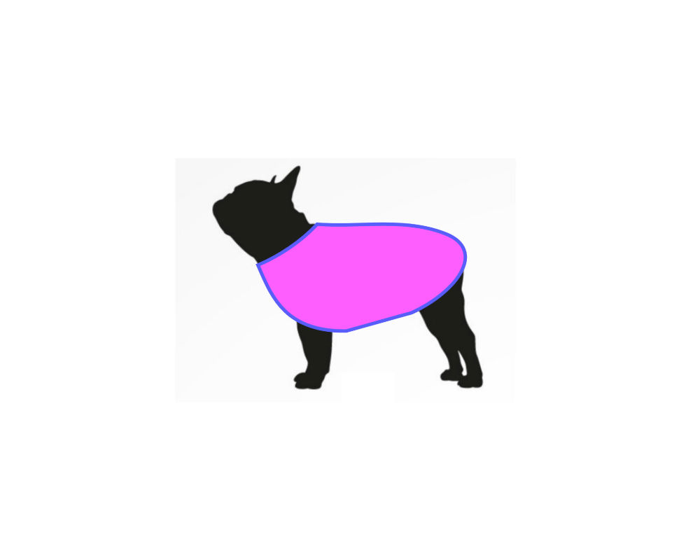

---?image=assets/bg1.jpeg

---?image=assets/bg2.jpeg

Note: How many rails devs?  Elixir devs?  Just starting out?  Anything else you'd like me to ask?

---?image=assets/bg3.jpeg

Note: This is practical - Compare/Contrast (mostly contrast) with rails counterparts.


---?image=assets/bg4.jpeg

Note: Let' start with images...

---?image=assets/bg5.jpeg

Note: Create thumbnails, resize etc. as with Paperclip or Carrierwave in Rails

---?image=assets/bg6.jpeg

Note: Local store (as opposed to cdn), use Arc Ecto to integrate the two. Going over the highlights here.

---

## Multiple Images

```elixir
<%= file_input @form, :image_uploads,

    class: "validate",

    multiple: true,

    name: "user[image_upload][]" %>
```

Note: From here, you can iterate over the map of files for processing or saving, either as embeds array, or association.


---

```elixir
def changeset(struct, params \\ %{}) do
  struct
  |> cast(params, [:name, :description, :user_id])
  |> cast_attachments(params, [:photo])
  |> validate_required([:name, :description, :user_id])
  |> unique_constraint(:name, message: "already taken")
end
```

@[1-3]
@[4]
@[1-7]

---

## Plug.Upload Struct

### within changeset function params

---

```elixir
#[debug] Processing by Knitwhiz.DesignController.update/2

parameters: %{
  "id" => "6",
  "design" => %{
    "description" => "doggie sweater",
    "name" => "Fido's Sweater",
    "photo" => %Plug.Upload{
      content_type: "image/png",
      filename: "fidos-sweater.png",
      path: "/var/folders/2s/fs..66/T//plug-1493/multipart-53892"
    },
    "supplies" => "yarn"
  }
}
```

@[1-15]
@[8-12]


Note: Plug.Upload  Genserver process saves upload struct to a temp directory. After process dies the file moved to permanent home (either cdn or local store)


---

## Image Gotcha

### No Record ID on Create

```elixir

# uploaders/avatar
def storage_dir(_, {_, scope}) do

   "priv/static/images/user/#{scope.id}"

end
```

Note: Scope.id not available on create.

---

### Workaround

#### Use separate changesets for create and update

---


#### Programatically Insert Images

---

```elixir

case Repo.insert(changeset) do

  {:ok, pattern} ->
    template = Repo.get!(
      Template, pattern_params["template_id"])

    path = "priv/static/images/templates/#{template.id}"

    PatternImage.store({path, pattern})

    pattern_img_param = %{
      pattern_image_url: "../patterns/#{pattern.id}"}

    |> update_pattern
  end

```

@[1-3]

@[4-5]

@[4-9]

@[1-15]

### An Example

Note: Explain Background - User form for other info -> onCreate, get image associated with parent

---

## Amazon S3

## With Arc

#### https://github.com/stavro/arc

---

## Amazon S3 Without Arc

---

### Elixir apps

* :ex_aws & :ex_aws_s3 packages
* Create a Module
* Follow the README

#### https://github.com/ex-aws/ex_aws

Note: use mix task to move images onto s3 when ready...

---

# B is for Backend

---

## Phoenix as an API

### Receives Image Data from a Client Application


Note: often no need to use binary data (rails... used binary data) but Arc supports it


---

```javascript

handleImageChange(e) {
  e.preventDefault();

  const reader = new FileReader();
  const file = e.target.files[0];

  reader.onloadend = () => {
    this.setState({
      imagePreviewUrl: reader.result
    });
    this.setState({ design: { photo: file } });
  }

  reader.readAsDataURL(file)
}

handlePhotoUpdate() {
  this.props.setDesignField('photo', this.state.design.photo);
  this.props.submitPhotoUpdate(this.props.designId);
}
```

@[1-4]

@[6-11]

@[5, 10]

@[1-16]

### React Form Component

---

```javascript

export const updatePhoto = (id) => (
  (dispatch, getState) => {
    const { formData } = getState().designs;
    let form_data = new FormData();

    Object.keys(formData).forEach((key) => {
      if (formData[key] instanceof File) {
        form_data.append(`design[${key}]`, formData[key], formData[key].name);
      } else {
        form_data.append(`design[${key}]`, formData[key]);
      }
    });

    httpPostForm(`/api/v1/designs/${id}`, form_data)
    .then((resp) => {
      .
      .
```

@[1-15]

@[3]

@[4]

@[6-12]

@[14]

### Update Action

Note: FormData objects require a POST request

---

### FormData objects must be sent in a POST request

#### update router.ex

* resources "/designs", DesignController, except: [:new, :edit]
* post "/designs/:id", DesignController, :update

---

# C is for Copy

---


### Copy inside a Mix Task

#### Using File Module

Note: suppose admin, not using Arc, etc. & want to copy a template to further manipulate.

---

#### Elixir

```elixir
cp(source, destination, callback \\ fn _, _ -> true end)
# => {:ok} OR {:error, :reason}
```
#### OR Erlang

```elixir

copy(source, destination, bytes_count \\ :infinity)
# => {:ok, :bytes_copied} OR {:error, :reason}
```
Note:  copy without using Arc Storage, or copy from S3 for example...

---



### User manipulation of SVG file

---


```xml
<svg width="640" height="480" xmlns="http://www.w3.org/2000/svg" xmlns:svg="http://www.w3.org/2000/svg">
 <g>
  <title>Layer 1</title>
  <path
    id="svg_6"
    stroke="#5656ff"
    d="m159.408943,208.251741c31.05263,-13 64.10526,-35
      87.15789,-60c62.94737,4.66667 128.89473,
      -9.66667 188.8421,14c59.94737,23.66667 19.62907,
      84 -49.55639,116l-96.74435,27c-90.45113,
      1.33333 -110.41354,-52.33333 -129.69925,-97z"
    stroke-linecap="null"
    stroke-linejoin="null"
    stroke-dasharray="null"
    stroke-width="5"
    fill="#ff56ff" />
 </g>
</svg>

```

#### Dog Sweater Template SVG

---


### Using D3 or similar library

---


### Save the Transformed File...

---

#### Using Nokogiri with Rails

```ruby
# AJAX POST -> updates svg path with Nokogiri

  def update_path
    if params[:id] && params[:svg_d_attr]
      @pattern = Pattern.find(params[:id].to_i)

      file_path = "#{Rails.root}/public/#{@pattern.image_url}"

      doc = Nokogiri::XML(File.read file_path)

      doc.css("path").first["d"] = params[:svg_d_attr]

      File.open(file_path,'w') {|f| doc.write_xml_to f}
    end
```
@[1-14]

@[7]

@[9-11]

@[13]

Note:  get the file path, then set the

---
#### Using Floki with Phoenix

```elixir
@doc """
  Changes the attribute values of the elements matched
  by `selector` with the function `mutation` and returns
  the whole element tree

  svg
  |> Floki.attr("path", "d", fn_ ->  params["svg_d_attr"]) end)

```

Note: (tree, element, attribute, mutation function)

---
### Links

#### https://github.com/philss/floki/blob/master/lib/floki.ex

#### https://gitpitch.com/cathyzoller/ticket_to_fly

---

### Acknowledgements


#### <a href="https://www.freepik.com/free-photos-vectors/dog">Dog vector created by Freepik</a>

#### http://moderndogmagazine.com/articles/dog-sweaters-so-cute-youll-want-wear-them/91180


